# SAM 深度解析：前端图像分割实践指南

> 一份面向前端开发者的 SAM（Segment Anything Model）技术深度解析文档  
> 从理论到实践，从使用到原理，全面掌握 Web 端智能图像分割

---

## 📚 目录

- [第一章：SAM 技术背景与核心概念](#第一章sam-技术背景与核心概念)
- [第二章：@lego/sam 包架构设计](#第二章legosam-包架构设计)
- [第三章：快速上手 - 自动分割实践](#第三章快速上手---自动分割实践)
- [第四章：进阶使用 - 交互式分割](#第四章进阶使用---交互式分割)
- [第五章：核心实现原理深度剖析](#第五章核心实现原理深度剖析)
- [第六章：数据结构与算法详解](#第六章数据结构与算法详解)
- [第七章：性能优化与最佳实践](#第七章性能优化与最佳实践)
- [第八章：常见问题与解决方案](#第八章常见问题与解决方案)

---

## 第一章：SAM 技术背景与核心概念

### 1.1 什么是 SAM？

**SAM（Segment Anything Model）** 是由 Meta AI 研究院在 2023 年推出的革命性图像分割模型。它最大的创新在于：

- **通用性**：一个模型可以分割任何对象，无需针对特定类别训练
- **提示驱动**：通过点击、框选等简单交互即可生成精确的分割结果
- **零样本能力**：对从未见过的对象也能进行准确分割

### 1.2 SAM 的工作原理

SAM 的核心是一个 **提示式分割范式**，它将图像分割任务拆解为两个阶段：

#### 阶段一：图像编码（Image Encoding）

将输入图像通过强大的视觉编码器（Vision Transformer）转换为高维特征表示，这个过程生成的 **embedding** 包含了图像的所有语义信息。

```
输入图像 → 视觉编码器 → Image Embedding (256×64×64)
```

**关键特点**：
- 这一步计算量大，但**只需执行一次**
- 生成的 embedding 可以复用于多次分割
- 在 Web 场景下，通常由后端服务完成

#### 阶段二：提示式解码（Prompt-based Decoding）

根据用户提供的提示（点击点、框选区域），结合 image embedding，快速生成分割 mask。

```
Embedding + 用户提示 → 轻量解码器 → Segmentation Mask
```

**关键特点**：
- 解码器非常轻量，可以在浏览器中实时运行
- 支持交互式修正：添加正点/负点来调整结果
- 可以生成多个候选 mask，自动选择最优结果

### 1.3 为什么需要 Web 端的 SAM？

传统的图像分割方案存在诸多限制：

| 传统方案 | SAM 方案 |
|---------|----------|
| 需要上传图片到服务器 | 前端实时处理 |
| 每次交互都需要网络请求 | 即时响应用户操作 |
| 服务器压力大 | 分布式计算（客户端） |
| 延迟高（网络+计算） | 毫秒级反馈 |

**@lego/sam 的价值**：将 SAM 能力带到浏览器，实现真正的实时交互式图像编辑。

### 1.4 核心概念解析

#### 概念 1：Mask（遮罩）

Mask 是一个与原图等大的二值图像，标识哪些像素属于目标对象。

- **白色区域（255）**：目标对象
- **黑色区域（0）**：背景
- **灰度值**：可以表示半透明或边缘柔和度

#### 概念 2：RLE（Run-Length Encoding）

一种高效的 mask 压缩编码方式，特别适合稀疏的二值图像。

**原理**：记录连续相同值的长度，而非逐像素存储。

```
示例：
原始数据：0 0 0 0 1 1 1 0 0 1 1 1 1 1
RLE 编码：[4, 3, 2, 5]  (4个0, 3个1, 2个0, 5个1)
```

**优势**：
- 压缩比高（通常 10-100 倍）
- 解码速度快
- 适合网络传输

#### 概念 3：Embedding（特征嵌入）

将图像转换为高维向量表示，包含图像的语义信息。

- **维度**：`1 × 256 × 64 × 64`（总计 104 万个浮点数）
- **大小**：约 4MB（未压缩）
- **生命周期**：一张图片生成一次，可复用于多次分割

#### 概念 4：Prompt（提示）

用户给模型的指令，告诉模型"我想分割什么"。

支持的提示类型：
- **点提示**：正点（包含）+ 负点（排除）
- **框提示**：矩形框定目标区域
- **Mask 提示**：用已有的 mask 作为提示

---

## 第二章：@lego/sam 包架构设计

### 2.1 整体架构概览

@lego/sam 采用分层架构设计，职责清晰，易于扩展。

```
┌─────────────────────────────────────────────────────────┐
│                     应用层 (Your App)                      │
└──────────────────────┬──────────────────────────────────┘
                       │
┌──────────────────────┴──────────────────────────────────┐
│                   工厂层 (Factory)                        │
│                    SamFactory                            │
│              统一入口 & 依赖管理                          │
└──────────┬────────────────────────┬─────────────────────┘
           │                        │
┌──────────┴────────────┐  ┌────────┴──────────────────┐
│    模型层 (Models)     │  │   服务层 (Services)        │
│  - AutoMaskModel       │  │  - ApiService             │
│  - SamModel            │  │  - FileService            │
│                        │  │  - OnnxModelService       │
└──────────┬─────────────┘  └───────────────────────────┘
           │
┌──────────┴──────────────────────────────────────────────┐
│                  结果层 (Results)                         │
│   BaseMaskResult → AutoMaskResult / MaskResult           │
│         统一的结果处理接口                                │
└──────────────────────────────────────────────────────────┘
```

### 2.2 核心类职责说明

#### 🏭 SamFactory - 工厂类

**职责**：统一入口，负责初始化和创建模型实例

**设计模式**：单例模式（Singleton）

**核心方法**：
```typescript
// 初始化工厂（全局只需一次）
SamFactory.getInstance(options)

// 创建自动分割模型
factory.createAutoMaskModel(imageUrl, autoMasks?)
```

**为什么需要工厂？**
- 管理全局依赖（ApiService、FileService 等）
- 避免重复初始化（ONNX 模型只加载一次）
- 提供统一的配置入口

#### 🤖 AutoMaskModel - 自动分割模型

**职责**：基于后端预生成的多层 mask，通过点击拾取和组合生成最终结果

**核心特性**：
- **多层分割**：一张图片包含多个分割层（从大到小）
- **点击拾取**：根据点击位置自动选中对应层
- **图层合成**：支持正选（叠加）和负选（扣除）

**关键方法**：
```typescript
// 点击切换层的选择状态
toggleLayerMode(x, y): AutoMaskResult | null

// 拾取点击位置的层（不改变状态）
pickLayer(x, y): AutoMaskLayer | null

// 获取当前合成结果
getMaskResult(): AutoMaskResult | null
```

**使用场景**：
- 快速分割场景（无需交互）
- 需要多次尝试不同区域组合
- 对实时性要求不高

#### 🧠 SamModel - 交互式分割模型

**职责**：基于 ONNX 前端推理，通过点击点实时生成 mask

**核心特性**：
- **实时推理**：在浏览器中运行 SAM 解码器
- **历史管理**：支持撤销/重做操作
- **增量计算**：利用上一次的 predMask 加速推理

**关键方法**：
```typescript
// 添加点击并生成新结果
addClick(click: IClick, snapshot: boolean): Promise<MaskResult>

// 批量设置点击（优化性能）
setClicks(clicks: IClick[]): Promise<void>

// 获取当前结果
getMaskResult(): Promise<MaskResult>
```

**使用场景**：
- 精确分割场景
- 需要用户精细调整
- 对实时反馈要求高

#### 📦 MaskResult - 结果对象

**职责**：封装分割结果，提供多种导出方式

**核心能力**：
- 导出为 Canvas（getMask）
- 导出抠图结果（getImage）
- 后端精修（matting）
- SVG 轮廓描边（仅 MaskResult）

### 2.3 数据流转图

#### 自动分割流程

```mermaid
graph LR
    A[图片 URL] --> B[ApiService.autoMasks]
    B --> C[后端返回 RLE 数据]
    C --> D[AutoMaskModel 初始化]
    D --> E[解码 RLE → Canvas]
    E --> F[ColorIdService 生成颜色 ID]
    F --> G[绘制到 pickCanvas]
    G --> H[用户点击]
    H --> I[根据颜色拾取层]
    I --> J[toggleLayerMode 切换状态]
    J --> K[合成多层 → AutoMaskResult]
    K --> L[导出 Mask/Image]
```



**关键节点说明**：

1. **RLE 解码**：将压缩的 mask 数据转换为 Canvas
2. **颜色 ID**：为每一层分配唯一颜色，用于拾取识别
3. **pickCanvas**：一个隐藏的 Canvas，存储所有层的颜色信息
4. **图层合成**：使用 Canvas 的 `globalCompositeOperation` 实现正负选区

#### 交互式分割流程

```mermaid
graph LR
    A[图片 URL] --> B[ApiService.embedding]
    B --> C[后端生成 Embedding]
    C --> D[OnnxModelService 加载模型]
    D --> E[SamModel 初始化]
    E --> F[用户点击]
    F --> G[toModelData 准备输入]
    G --> H[ONNX 推理]
    H --> I[getBestMask 选择最优]
    I --> J[onnxDataToMask 转换]
    J --> K[生成 SVG 轮廓]
    K --> L[MaskResult 返回]
```



**关键节点说明**：

1. **Embedding 加载**：从后端获取预计算的图像特征
2. **模型加载**：首次会下载 ONNX 模型（~40MB），后续从缓存读取
3. **多候选选择**：SAM 输出 3 个候选 mask，根据 score 选最优
4. **SVG 轮廓**：从像素 mask 提取轮廓，用于描边显示

---

## 第三章：快速上手 - 自动分割实践

### 3.1 环境准备

#### 安装依赖

```bash
npm install @lego/sam axios
```

#### 浏览器兼容性检查

```typescript
import { isSupportSam } from '@lego/sam';

if (!isSupportSam()) {
  alert('您的浏览器不支持 SAM 功能');
}
```

**兼容性要求**：
- 支持 `BigInt64Array`（Chrome 67+, Safari 15+）
- 支持 Canvas API
- 建议支持 WebGPU（更快的推理速度）

### 3.2 初始化工厂

工厂需要三个核心依赖注入：

```typescript
import { SamFactory } from '@lego/sam';
import axios from 'axios';

const factory = SamFactory.getInstance({
  // Axios 实例（用于调用后端 API）
  axiosInstance: axios.create({
    baseURL: 'https://your-api.com',
    timeout: 30000
  }),
  
  // 文件上传方法
  upload: async (blob: Blob) => {
    const formData = new FormData();
    formData.append('file', blob);
    const res = await axios.post('/upload', formData);
    return res.data.url;
  },
  
  // 图片加载方法
  loadImage: (url: string) => {
    return new Promise((resolve, reject) => {
      const img = new Image();
      img.crossOrigin = 'anonymous';
      img.onload = () => resolve(img);
      img.onerror = reject;
      img.src = url;
    });
  }
});
```

**配置说明**：

- **axiosInstance**：用于调用后端的 embedding、auto-masks、matting 接口
- **upload**：将 blob 上传到 CDN，返回可访问的 URL
- **loadImage**：加载图片并处理跨域问题

### 3.3 创建自动分割模型

```typescript
const imageUrl = 'https://example.com/photo.jpg';

// 方式一：自动获取 auto-masks
const autoMaskModel = await factory.createAutoMaskModel(imageUrl);

// 方式二：使用已有的 masks 数据（避免重复请求）
const cachedMasks = [...]; // 从缓存或其他地方获取
const autoMaskModel = await factory.createAutoMaskModel(imageUrl, cachedMasks);
```

**内部发生了什么？**

1. 调用后端 `/gdesign/tool/ai/auto-masks` 接口
2. 后端返回多层 RLE 格式的 mask 数据
3. 前端解码 RLE，为每一层生成 Canvas
4. 构建颜色拾取画布（pickCanvas）

### 3.4 交互式选择区域

#### 场景一：点击选中单个对象

```typescript
// 用户点击图片上的某个位置
const x = 320;  // 点击的 x 坐标（原图坐标系）
const y = 240;  // 点击的 y 坐标

const result = autoMaskModel.toggleLayerMode(x, y);

if (result) {
  // 显示选中效果
  const maskCanvas = result.getMask();
  displayOnScreen(maskCanvas);
}
```

**toggleLayerMode 的逻辑**：

1. 根据点击位置拾取对应的层
2. 如果该层未选中 → 选中（正选）
3. 如果该层已选中 → 取消选中
4. 如果该层在其他已选中层内部 → 负选（扣除）

#### 场景二：组合多个区域

```typescript
// 第一次点击：选中主体
autoMaskModel.toggleLayerMode(300, 200);

// 第二次点击：添加配件
autoMaskModel.toggleLayerMode(350, 180);

// 第三次点击：扣除不要的部分
autoMaskModel.toggleLayerMode(320, 190);

// 获取最终组合结果
const finalResult = autoMaskModel.getMaskResult();
```

**图层合成原理**：

使用 Canvas 的混合模式（`globalCompositeOperation`）：
- **source-over**：正选，将当前层叠加到结果上
- **destination-out**：负选，从结果中扣除当前层

### 3.5 导出结果

#### 导出 Mask

```typescript
const result = autoMaskModel.getMaskResult();

// 默认白色 mask
const maskCanvas = result.getMask();

// 自定义颜色（RGBA）
const coloredMask = result.getMask([255, 0, 0, 255]); // 红色

// 导出到已有 Canvas
const existingCanvas = document.getElementById('canvas');
result.getMask(undefined, existingCanvas);
```

#### 导出抠图结果

```typescript
// 获取抠出的前景图像
const imageCanvas = result.getImage();

// 转换为 Blob 用于下载或上传
imageCanvas.toBlob((blob) => {
  const url = URL.createObjectURL(blob);
  const a = document.createElement('a');
  a.href = url;
  a.download = 'cutout.png';
  a.click();
});
```

#### 后端精修（Matting）

```typescript
// 调用后端算法对 mask 边缘进行平滑处理
await result.matting();

// 获取精修后的结果
const refinedMask = result.getMask();
const refinedImage = result.getImage();
```

**什么是 Matting？**

Matting（精修）是一种图像处理技术，用于优化分割边缘：
- 处理半透明区域（如头发、玻璃）
- 平滑锯齿边缘
- 更自然的前景/背景融合

### 3.6 完整示例

```typescript
// 1. 初始化
const factory = SamFactory.getInstance({ /* config */ });

// 2. 创建模型
const model = await factory.createAutoMaskModel(imageUrl);

// 3. 监听用户点击
canvas.addEventListener('click', async (e) => {
  const rect = canvas.getBoundingClientRect();
  const x = (e.clientX - rect.left) / rect.width * image.naturalWidth;
  const y = (e.clientY - rect.top) / rect.height * image.naturalHeight;
  
  const result = model.toggleLayerMode(x, y);
  
  if (result) {
    // 显示 mask
    const maskCanvas = result.getMask([0, 255, 0, 128]); // 半透明绿色
    overlayCanvas.getContext('2d').drawImage(maskCanvas, 0, 0);
  }
});

// 4. 导出按钮
downloadBtn.addEventListener('click', async () => {
  const result = model.getMaskResult();
  if (!result) return;
  
  // 可选：精修
  await result.matting();
  
  // 导出
  const image = result.getImage();
  image.toBlob((blob) => {
    saveAs(blob, 'cutout.png');
  });
});
```

---

## 第四章：进阶使用 - 交互式分割

### 4.1 何时使用交互式分割？

**适用场景**：
- 自动分割效果不理想时
- 需要精确控制分割边界
- 对象边界复杂（如头发、透明物体）
- 需要实时预览调整效果

**对比自动分割**：

| 特性 | 自动分割 | 交互式分割 |
|------|---------|-----------|
| 速度 | 快（无推理） | 较慢（实时推理） |
| 精度 | 较低 | 高 |
| 交互性 | 简单点击 | 多点调整 |
| 适用场景 | 快速选择 | 精确分割 |

### 4.2 创建 SamModel

由于当前版本的工厂类没有暴露 `createModel` 方法（被注释），我们需要手动创建：

```typescript
import { SamModel } from '@lego/sam';
import { Tensor } from 'onnxruntime-web';

// 步骤 1：获取 embedding
const embeddingUrl = await apiService.embedding(imageUrl);

// 步骤 2：加载 ONNX 模型
await OnnxModelService.getModel({ 
  onnxUrl: 'https://cdn.example.com/sam_decoder.onnx'
});

// 步骤 3：加载图片
const image = await fileService.loadImage(imageUrl);

// 步骤 4：处理 embedding
const base64Str = await fetch(embeddingUrl).then(res => res.text());
const data = atob(base64Str);
const uint8Array = new Uint8Array(data.length);
for (let i = 0; i < data.length; i++) {
  uint8Array[i] = data.charCodeAt(i);
}

// 步骤 5：创建 Tensor
const tensor = new Tensor(
  'float32', 
  new Float32Array(uint8Array.buffer), 
  [1, 256, 64, 64]
);

// 步骤 6：计算缩放信息
const modelScale = handleImageScale(image);

// 步骤 7：创建 SamModel
const samModel = new SamModel(tensor, image, modelScale, embeddingUrl);
```

**为什么这么复杂？**

交互式分割需要在前端运行 ONNX 模型，涉及：
- Embedding 的加载和解析
- ONNX Runtime 的初始化
- 图像缩放的计算（SAM 模型有固定输入尺寸）

### 4.3 添加点击提示

#### 点击类型

```typescript
type IClick = [x: number, y: number, type: 0 | 1];
// type: 1 = 正点（包含），0 = 负点（排除）
```

#### 添加正点

```typescript
// 用户点击想要包含的区域
const result = await samModel.addClick([320, 240, 1], true);

if (result) {
  // 显示分割结果
  const maskCanvas = result.getMask();
  displayMask(maskCanvas);
  
  // 显示 SVG 轮廓（更美观）
  const svgCanvas = result.getMaskSegments({
    color: [0, 255, 0, 255],  // 绿色
    strokeWidth: 2,
    blur: 0
  });
}
```

**参数说明**：
- 第一个参数：点击坐标和类型
- 第二个参数：是否保存快照（用于撤销/重做）

#### 添加负点修正

```typescript
// 第一次点击：选中大致区域
await samModel.addClick([300, 200, 1], true);

// 第二次点击：排除不要的部分
await samModel.addClick([350, 180, 0], true);

// 第三次点击：再次包含遗漏的部分
await samModel.addClick([280, 220, 1], true);
```

**负点的作用**：
- 精细调整分割边界
- 排除误选区域
- 解决多对象粘连问题

### 4.4 历史管理

SamModel 内置了历史管理机制，支持撤销和重做。

```typescript
// 添加多个点击（每次保存快照）
await samModel.addClick([300, 200, 1], true);  // 快照 1
await samModel.addClick([320, 180, 1], true);  // 快照 2
await samModel.addClick([350, 220, 0], true);  // 快照 3

// 回到快照 2 的状态
await samModel.setClicks([
  [300, 200, 1],
  [320, 180, 1]
]);

// 重新开始
samModel.reset();
```

**历史管理的优化**：
- 如果新点击序列的前缀与历史匹配，直接复用缓存的 `predMask`
- 避免重复计算，提升性能

### 4.5 SVG 轮廓描边

MaskResult 独有的功能：将像素 mask 转换为矢量轮廓。

```typescript
const result = await samModel.getMaskResult();

// 获取 SVG 轮廓描边
const strokeCanvas = result.getMaskSegments({
  color: [255, 0, 0, 255],  // 红色
  strokeWidth: 3,           // 线宽
  blur: 2                   // 模糊效果
});

// 叠加显示
ctx.drawImage(image, 0, 0);
ctx.drawImage(strokeCanvas, 0, 0);
```

**应用场景**：
- 选区预览（不遮挡原图）
- 高亮显示分割边界
- 导出为矢量格式

### 4.6 性能优化技巧

#### 技巧 1：批量设置点击

```typescript
// ❌ 低效：逐个添加
for (const click of clicks) {
  await samModel.addClick(click, true);
}

// ✅ 高效：批量设置
await samModel.setClicks(clicks);
```

#### 技巧 2：利用 predMask

```typescript
// addClick 的第二个参数控制是否保存快照
// 临时预览时不保存，确认后再保存

// 预览模式（不保存）
const previewResult = await samModel.addClick([x, y, 1], false);

// 用户确认后保存
if (confirmed) {
  await samModel.addClick([x, y, 1], true);
}
```

#### 技巧 3：复用 Embedding

```typescript
// Embedding 只需生成一次
const embeddingUrl = await apiService.embedding(imageUrl);

// 可以创建多个 SamModel 实例，共享同一个 embedding
const model1 = new SamModel(tensor, image, modelScale, embeddingUrl);
const model2 = new SamModel(tensor, image, modelScale, embeddingUrl);
```

---

## 第五章：核心实现原理深度剖析

### 5.1 RLE 解码算法

RLE（Run-Length Encoding）是自动分割的核心数据格式。

#### 编码格式

后端返回的 RLE 数据结构：
```typescript
{
  counts: [8, 15, 4, 23, ...],  // 游程数组
  size: [height, width]          // 图像尺寸
}
```

**读取规则**：
- 偶数索引（0, 2, 4...）：0 的个数
- 奇数索引（1, 3, 5...）：1 的个数

#### 解码实现原理

```typescript
// 核心逻辑
let currentPosition = 0;
for (let i = 0; i < rle.length; i += 2) {
  const zeroCount = rle[i];
  const oneCount = rle[i + 1];
  
  currentPosition += zeroCount;  // 跳过 0
  
  for (let j = 0; j < oneCount; j++) {
    data[currentPosition * 4] = 255;      // R
    data[currentPosition * 4 + 1] = 255;  // G
    data[currentPosition * 4 + 2] = 255;  // B
    data[currentPosition * 4 + 3] = 255;  // A
    currentPosition++;
  }
}
```

**坐标转换**：

SAM 输出的 RLE 是**旋转 90 度**的，需要额外处理：

```typescript
// 创建临时画布（宽高互换）
const tempCanvas = document.createElement('canvas');
tempCanvas.width = height;   // 注意：宽度 = 原图高度
tempCanvas.height = width;

// 解码到临时画布
ctx.putImageData(imageData, 0, 0);

// 旋转回正常方向
maskCtx.scale(1, -1);
maskCtx.rotate(-90 * Math.PI / 180);
maskCtx.drawImage(tempCanvas, 0, 0);
```

### 5.2 颜色 ID 拾取系统

AutoMaskModel 的核心技术：如何快速定位用户点击的层？

#### 设计思路

为每一层分配一个**唯一的颜色 ID**：

```typescript
class ColorIdService {
  private n = 0;
  
  generateID(): [string, [number, number, number, number]] {
    this.n += 1;
    const r = (this.n >>> 16) & 0xFF;
    const g = (this.n >>> 8) & 0xFF;
    const b = this.n & 0xFF;
    
    return [
      this.n.toString(),
      [r, g, b, 255]
    ];
  }
}
```

**关键特性**：
- 每个 ID 对应一个唯一的 RGB 值
- 颜色由数字编码，确保不重复
- 最多支持 16,777,216 层（2^24）

#### 拾取流程

```typescript
// 1. 创建隐藏的 pickCanvas
const pickCanvas = document.createElement('canvas');
pickCanvas.width = width;
pickCanvas.height = height;

// 2. 将所有层用各自的颜色 ID 绘制到 pickCanvas
layers.forEach(layer => {
  const mask = rleToMask(layer.segmentation, layer.color);
  pickCtx.drawImage(mask, 0, 0);
});

// 3. 用户点击时，读取 pickCanvas 上的颜色
const imageData = pickCtx.getImageData(x, y, 1, 1);
const [r, g, b, a] = imageData.data;

// 4. 根据颜色查找对应的层
const layer = layers.find(l => {
  return colorDistance(l.color, [r, g, b, a]) < threshold;
});
```

**为什么不用直接遍历？**

如果直接判断每一层的 Canvas：
```typescript
// ❌ 低效方法
layers.forEach(layer => {
  const ctx = layer.maskCanvas.getContext('2d');
  const pixel = ctx.getImageData(x, y, 1, 1);
  if (pixel.data[3] > 0) {
    // 找到了
  }
});
```

**问题**：
- 需要遍历所有层（O(n)）
- 每次都要读取 ImageData（性能差）

**颜色 ID 方案**：
- 只读取一次 pickCanvas（O(1)）
- 通过颜色直接定位层

### 5.3 图层合成算法

AutoMaskModel 支持复杂的图层组合逻辑。

#### 合成模式

使用 Canvas 的 `globalCompositeOperation`：

| 模式 | 说明 | 视觉效果 |
|------|------|---------|
| `source-over` | 正选（叠加） | 将层添加到结果中 |
| `destination-out` | 负选（扣除） | 从结果中移除层 |
| `null` | 未选中 | 不参与合成 |

#### 智能模式切换

```typescript
toggleLayerMode(x, y) {
  const layer = this.pickLayer(x, y);
  
  // 查找点击位置是否有其他已选中的层
  const overlappingLayers = this.autoMaskLayers.filter(other => {
    if (other === layer || other.mode === null) return false;
    
    // 检查该层在点击位置是否有像素
    const ctx = other.maskCanvas.getContext('2d');
    const pixel = ctx.getImageData(x, y, 1, 1);
    return pixel.data[3] > 0;
  });
  
  // 根据重叠情况决定模式
  if (overlappingLayers.length > 0) {
    // 有重叠：智能切换
    const largerLayer = overlappingLayers.find(l => l.area > layer.area);
    if (largerLayer && largerLayer.mode === 'source-over') {
      // 在正选层内部 → 负选
      layer.mode = 'destination-out';
    }
  } else {
    // 无重叠：简单切换
    layer.mode = layer.mode === 'source-over' ? null : 'source-over';
  }
}
```

**逻辑说明**：

1. **无重叠**：选中 ↔ 未选中
2. **在正选层内部**：未选中 → 负选 → 未选中
3. **在负选层内部**：正常切换

#### 最终合成

```typescript
const canvas = document.createElement('canvas');
const ctx = canvas.getContext('2d');

layers.forEach(layer => {
  if (layer.mode !== null) {
    ctx.globalCompositeOperation = layer.mode;
    ctx.drawImage(layer.maskCanvas, 0, 0);
  }
});
```

### 5.4 ONNX 推理流程

交互式分割的核心：在浏览器中运行 SAM 解码器。

#### 模型输入准备

SAM 解码器需要 4 个输入：

```typescript
const feeds = {
  'image_embeddings': tensor,           // 图像特征 [1, 256, 64, 64]
  'point_coords': pointCoordsTensor,    // 点击坐标 [1, N, 2]
  'point_labels': pointLabelsTensor,    // 点击类型 [1, N]
  'mask_input': maskInputTensor,        // 上次的 mask [1, 1, 256, 256]
  'has_mask_input': hasMaskInputTensor, // 是否有历史 mask [1]
  'orig_im_size': origImSizeTensor      // 原图尺寸 [2]
};
```

**关键点**：
- 坐标需要归一化到模型输入尺寸（通常是 1024×1024）
- `mask_input` 用于增量计算，提升性能
- 首次推理时，`has_mask_input` 为 0

#### 模型推理

```typescript
const session = await InferenceSession.create(modelUrl);
const results = await session.run(feeds);

const output = results['masks'];        // 输出 mask [1, 3, 256, 256]
const scores = results['iou_predictions']; // 质量评分 [1, 3]
```

**输出说明**：
- SAM 输出 **3 个候选 mask**
- 每个 mask 有对应的质量评分（IOU）
- 通常选择评分最高的 mask

#### 最优 Mask 选择

```typescript
function getBestMask(masks, scores) {
  let bestIndex = 0;
  let bestScore = scores[0];
  
  for (let i = 1; i < 3; i++) {
    if (scores[i] > bestScore) {
      bestScore = scores[i];
      bestIndex = i;
    }
  }
  
  return masks.slice(
    bestIndex * width * height,
    (bestIndex + 1) * width * height
  );
}
```

### 5.5 Mask 转 SVG 轮廓

MaskResult 的特色功能：生成矢量轮廓。

#### 轮廓提取

使用 **Marching Squares** 算法：

```typescript
// 1. 将 mask 转为 RLE 格式
const rleMask = maskToRLE(maskData);

// 2. 提取轮廓点
const segments = rleMaskToSegments(rleMask);
// segments: Array<Array<[x, y]>>

// 3. 转换为 SVG Path
const svgPaths = segments.map(segment => {
  let path = `M ${segment[0][0]} ${segment[0][1]}`;
  for (let i = 1; i < segment.length; i++) {
    path += ` L ${segment[i][0]} ${segment[i][1]}`;
  }
  path += ' Z';  // 闭合路径
  return path;
});
```

#### 绘制轮廓

```typescript
ctx.strokeStyle = 'rgba(0, 255, 0, 1)';
ctx.lineWidth = 2;

svgPaths.forEach(pathData => {
  const path = new Path2D(pathData);
  ctx.stroke(path);
});
```

---

## 第六章：数据结构与算法详解

### 6.1 核心类型定义

#### IClick - 点击点

```typescript
type IClick = [x: number, y: number, type: 0 | 1];
```

**说明**：
- `x, y`：相对于原图的绝对坐标
- `type`：1 为正点（包含），0 为负点（排除）

#### ModelScale - 缩放信息

```typescript
interface ModelScale {
  samScale: number;  // 缩放比例
  height: number;    // 模型输入高度
  width: number;     // 模型输入宽度
}
```

**用途**：
- 将用户点击坐标映射到模型输入空间
- SAM 模型有固定的输入尺寸（1024×1024）

#### AutoMaskLayer - 自动分割层

```typescript
interface AutoMaskLayer {
  id: string;                    // 唯一标识
  color: [R, G, B, A];           // 颜色 ID
  mode: null | 'source-over' | 'destination-out';  // 合成模式
  area: number;                  // 层的面积（像素数）
  maskCanvas: HTMLCanvasElement; // 层的 mask 画布
  segmentation: {                // RLE 数据
    counts: number[];
    size: [height, width];
  };
}
```

**设计要点**：
- `color` 用于拾取识别
- `area` 用于判断层的包含关系
- `mode` 控制如何参与合成

### 6.2 关键算法

#### 算法 1：坐标归一化

将屏幕坐标转换为模型输入坐标：

```typescript
function normalizeCoordinate(
  x: number, 
  y: number, 
  modelScale: ModelScale
): [number, number] {
  return [
    x * modelScale.samScale,
    y * modelScale.samScale
  ];
}
```

#### 算法 2：图像缩放计算

```typescript
function handleImageScale(image: HTMLImageElement): ModelScale {
  const MAX_SIZE = 1024;  // SAM 的输入尺寸
  
  const { naturalWidth: width, naturalHeight: height } = image;
  const scale = MAX_SIZE / Math.max(width, height);
  
  return {
    samScale: scale,
    width: Math.round(width * scale),
    height: Math.round(height * scale)
  };
}
```

**注意**：
- 保持宽高比
- 长边缩放到 1024

#### 算法 3：颜色距离计算

```typescript
function colorDistance(
  color1: [R, G, B, A],
  color2: [R, G, B, A]
): number {
  const dr = color1[0] - color2[0];
  const dg = color1[1] - color2[1];
  const db = color1[2] - color2[2];
  const da = color1[3] - color2[3];
  
  return Math.sqrt(dr*dr + dg*dg + db*db + da*da);
}
```

**用途**：
- 判断点击位置的颜色与哪个层匹配
- 阈值通常设为 3（允许轻微色差）

### 6.3 内存管理

#### Canvas 释放

```typescript
release() {
  // 清空画布数据
  this.maskCanvas.width = 1;
  this.maskCanvas.height = 1;
  
  // 清空 Map
  this.layerMap.clear();
}
```

**为什么设置为 1×1？**
- Canvas 占用内存与尺寸成正比
- 设为 1×1 可释放几乎所有内存
- 比 `width = 0` 更安全（避免某些浏览器的 bug）

#### ONNX 模型缓存

```typescript
class OnnxModelService {
  private static modelCache: InferenceSession | null = null;
  
  static async getModel(options) {
    if (!this.modelCache) {
      this.modelCache = await InferenceSession.create(options.onnxUrl);
    }
    return this.modelCache;
  }
}
```

**优化点**：
- 模型只加载一次（~40MB）
- 全局共享，避免重复下载

---

## 第七章：性能优化与最佳实践

### 7.1 性能瓶颈分析

#### 瓶颈 1：ONNX 模型加载

**问题**：
- 模型文件约 40MB
- 首次加载耗时 2-5 秒

**优化方案**：
1. **CDN 加速**：将模型托管在 CDN 上
2. **预加载**：在用户可能需要前提前加载
3. **Service Worker 缓存**：离线可用

```typescript
// 预加载
async function preloadSamModel() {
  const modelUrl = 'https://cdn.example.com/sam_decoder.onnx';
  await OnnxModelService.getModel({ onnxUrl: modelUrl });
}

// 在应用初始化时调用
preloadSamModel();
```

#### 瓶颈 2：Embedding 获取

**问题**：
- 依赖后端计算（1-3 秒）
- 每张图片都需要请求

**优化方案**：
1. **缓存 Embedding**：同一图片复用
2. **批量处理**：预先生成常用图片的 embedding
3. **渐进式加载**：先用自动分割，embedding 准备好后再支持交互式

```typescript
const embeddingCache = new Map<string, string>();

async function getEmbedding(imageUrl: string) {
  if (embeddingCache.has(imageUrl)) {
    return embeddingCache.get(imageUrl);
  }
  
  const url = await apiService.embedding(imageUrl);
  embeddingCache.set(imageUrl, url);
  return url;
}
```

#### 瓶颈 3：Canvas 绘制

**问题**：
- 高分辨率图片绘制耗时
- 频繁重绘导致卡顿

**优化方案**：
1. **离屏 Canvas**：预先绘制，减少主线程阻塞
2. **防抖处理**：合并连续操作
3. **分辨率降级**：显示时用低分辨率，导出时用高分辨率

```typescript
// 防抖
let debounceTimer;
canvas.addEventListener('mousemove', (e) => {
  clearTimeout(debounceTimer);
  debounceTimer = setTimeout(() => {
    updatePreview(e.clientX, e.clientY);
  }, 16); // 约 60fps
});
```

### 7.2 内存优化

#### 技巧 1：及时释放资源

```typescript
// 切换图片时
oldModel?.release();
oldResult?.release();

// 创建新模型
const newModel = await factory.createAutoMaskModel(newImageUrl);
```

#### 技巧 2：限制历史记录数

```typescript
class SamModel {
  private maxHistorySize = 20;
  
  addClick(click, snapshot) {
    if (snapshot) {
      this.history.push({ clicks, predMask });
      
      // 限制历史大小
      if (this.history.length > this.maxHistorySize) {
        this.history.shift();
      }
    }
  }
}
```

#### 技巧 3：使用 WeakMap

```typescript
// ❌ 可能导致内存泄漏
const resultCache = new Map<string, MaskResult>();

// ✅ 自动回收
const resultCache = new WeakMap<object, MaskResult>();
```

### 7.3 用户体验优化

#### 优化 1：加载状态提示

```typescript
async function createModelWithProgress(imageUrl: string) {
  showLoading('正在加载图片...');
  
  const model = await factory.createAutoMaskModel(imageUrl);
  
  hideLoading();
  showSuccess('加载完成！');
  
  return model;
}
```

**关键点**：
- 给用户明确的反馈
- 显示当前进度（如加载模型、生成 embedding）
- 避免"假死"体验

#### 优化 2：渐进式功能开放

```typescript
// 1. 首先提供快速的自动分割
const autoModel = await factory.createAutoMaskModel(imageUrl);
enableAutoMaskUI(autoModel);

// 2. 后台异步加载交互式分割的依赖
getEmbedding(imageUrl).then(embeddingUrl => {
  loadOnnxModel().then(() => {
    enableInteractiveMaskUI();
    showTip('高级功能已就绪');
  });
});
```

**设计理念**：
- 先满足基本需求（自动分割）
- 高级功能异步加载
- 不阻塞主流程

#### 优化 3：实时预览与确认机制

```typescript
let previewResult = null;

canvas.addEventListener('mousemove', async (e) => {
  if (!isInteractiveMode) return;
  
  // 实时预览（不保存到历史）
  const [x, y] = getCoordinates(e);
  previewResult = await samModel.addClick([x, y, 1], false);
  
  displayPreview(previewResult);
});

canvas.addEventListener('click', async (e) => {
  // 确认选择（保存到历史）
  const [x, y] = getCoordinates(e);
  const result = await samModel.addClick([x, y, 1], true);
  
  displayFinal(result);
});
```

**用户体验**：
- 移动时实时预览效果
- 点击时确认并保存
- 降低误操作成本

### 7.4 错误处理与容错

#### 错误 1：浏览器不兼容

```typescript
import { isSupportSam } from '@lego/sam';

if (!isSupportSam()) {
  showError('您的浏览器版本过低，请升级浏览器或使用 Chrome/Safari');
  fallbackToServerSideSolution();
}
```

#### 错误 2：网络请求失败

```typescript
async function robustCreateModel(imageUrl: string) {
  const MAX_RETRIES = 3;
  
  for (let i = 0; i < MAX_RETRIES; i++) {
    try {
      return await factory.createAutoMaskModel(imageUrl);
    } catch (error) {
      if (i === MAX_RETRIES - 1) {
        throw new Error('加载失败，请检查网络连接');
      }
      await sleep(1000 * (i + 1)); // 指数退避
    }
  }
}
```

#### 错误 3：内存不足

```typescript
window.addEventListener('error', (event) => {
  if (event.message.includes('memory')) {
    // 内存不足，释放资源
    releaseAllModels();
    showError('内存不足，已自动清理资源');
  }
});
```

### 7.5 最佳实践总结

#### 实践 1：分离关注点

```typescript
// ✅ 好的设计
class MaskEditor {
  private model: AutoMaskModel;
  private renderer: MaskRenderer;
  private interactionHandler: InteractionHandler;
  
  constructor() {
    // 数据、渲染、交互分离
  }
}

// ❌ 避免
class MaskEditor {
  // 所有逻辑混在一起
}
```

#### 实践 2：使用 TypeScript

```typescript
// 完整的类型定义
interface MaskEditorConfig {
  imageUrl: string;
  mode: 'auto' | 'interactive';
  onResult: (result: BaseMaskResult) => void;
  onError: (error: Error) => void;
}

// 类型安全
function createEditor(config: MaskEditorConfig) {
  // TypeScript 会检查所有参数
}
```

#### 实践 3：组件化封装

```typescript
// 封装为独立组件
class SamMaskEditor extends HTMLElement {
  private factory: SamFactory;
  private model: AutoMaskModel | null = null;
  
  async setImage(url: string) {
    this.model = await this.factory.createAutoMaskModel(url);
    this.render();
  }
  
  async export(format: 'mask' | 'image') {
    const result = this.model?.getMaskResult();
    return format === 'mask' 
      ? result?.getMask() 
      : result?.getImage();
  }
}

// 使用
customElements.define('sam-mask-editor', SamMaskEditor);
```

---

## 第八章：常见问题与解决方案

### 8.1 功能相关问题

#### Q1: 为什么点击没有反应？

**可能原因**：

1. **坐标系不匹配**
   ```typescript
   // ❌ 错误：使用屏幕坐标
   model.toggleLayerMode(e.clientX, e.clientY);
   
   // ✅ 正确：转换为图片坐标
   const rect = canvas.getBoundingClientRect();
   const scaleX = image.naturalWidth / rect.width;
   const scaleY = image.naturalHeight / rect.height;
   const x = (e.clientX - rect.left) * scaleX;
   const y = (e.clientY - rect.top) * scaleY;
   model.toggleLayerMode(x, y);
   ```

2. **点击位置超出图片范围**
   ```typescript
   // 添加边界检查
   if (x < 0 || x >= image.naturalWidth || 
       y < 0 || y >= image.naturalHeight) {
     console.warn('点击位置超出图片范围');
     return;
   }
   ```

3. **模型未初始化完成**
   ```typescript
   // 确保模型创建完成后再允许交互
   const model = await factory.createAutoMaskModel(imageUrl);
   canvas.style.pointerEvents = 'auto'; // 启用交互
   ```

#### Q2: 为什么自动分割层数很少？

**原因解析**：

后端的 `auto-masks` 接口会根据图片复杂度生成不同数量的层：
- 简单图片：3-10 层
- 复杂图片：20-50 层
- 极端复杂：50-100 层

**优化方案**：

```typescript
// 在请求时调整配置
const config = {
  url: imageUrl,
  mask_generator_config: {
    output_mode: 'uncompressed_rle',
    points_per_side: 32,        // 增加采样点（默认 32）
    pred_iou_thresh: 0.7,       // 降低质量阈值（默认 0.88）
    stability_score_thresh: 0.8 // 降低稳定性阈值（默认 0.95）
  }
};
```

**权衡考虑**：
- 层数越多 → 分割越精细 → 性能开销越大
- 层数越少 → 加载越快 → 分割精度降低

#### Q3: 为什么交互式分割很慢？

**性能分析**：

交互式分割的耗时构成：
1. **首次模型加载**：2-5 秒（仅一次）
2. **Embedding 获取**：1-3 秒（每张图片一次）
3. **每次推理**：50-200ms

**优化策略**：

```typescript
// 1. 使用 WebGPU 加速
import { InferenceSession } from 'onnxruntime-web';

InferenceSession.create(modelUrl, {
  executionProviders: ['webgpu', 'wasm', 'cpu']
});

// 2. 降低输入分辨率
function handleImageScale(image: HTMLImageElement): ModelScale {
  const MAX_SIZE = 512; // 从 1024 降低到 512
  // ... 其余逻辑
}

// 3. 使用 Web Worker
const worker = new Worker('sam-worker.js');
worker.postMessage({ action: 'predict', clicks });
worker.onmessage = (e) => {
  const result = e.data.result;
  displayMask(result);
};
```

#### Q4: 如何处理大图片？

**问题描述**：

大尺寸图片（如 4K、8K）会导致：
- 内存占用过高
- Canvas 绘制缓慢
- 浏览器崩溃

**解决方案**：

```typescript
// 1. 预处理：压缩图片
async function preprocessImage(imageUrl: string) {
  const MAX_DIMENSION = 2048;
  
  const img = await loadImage(imageUrl);
  
  if (img.naturalWidth <= MAX_DIMENSION && 
      img.naturalHeight <= MAX_DIMENSION) {
    return imageUrl; // 无需压缩
  }
  
  // 压缩
  const canvas = document.createElement('canvas');
  const scale = MAX_DIMENSION / Math.max(img.naturalWidth, img.naturalHeight);
  canvas.width = img.naturalWidth * scale;
  canvas.height = img.naturalHeight * scale;
  
  const ctx = canvas.getContext('2d')!;
  ctx.drawImage(img, 0, 0, canvas.width, canvas.height);
  
  return canvasToBlob(canvas);
}

// 2. 使用压缩后的图片
const compressedUrl = await preprocessImage(originalUrl);
const model = await factory.createAutoMaskModel(compressedUrl);
```

### 8.2 集成相关问题

#### Q5: 如何与现有编辑器集成？

**集成方案**：

```typescript
// 假设现有编辑器使用 Fabric.js
import { fabric } from 'fabric';
import { SamFactory } from '@lego/sam';

class FabricSamIntegration {
  private canvas: fabric.Canvas;
  private samFactory: SamFactory;
  private currentModel: AutoMaskModel | null = null;
  
  constructor(canvasElement: HTMLCanvasElement) {
    this.canvas = new fabric.Canvas(canvasElement);
    this.samFactory = SamFactory.getInstance({ /* config */ });
  }
  
  async loadImage(url: string) {
    // 加载到 Fabric
    const img = await fabric.Image.fromURL(url);
    this.canvas.add(img);
    
    // 同时创建 SAM 模型
    this.currentModel = await this.samFactory.createAutoMaskModel(url);
  }
  
  async addMaskAsObject(x: number, y: number) {
    const result = this.currentModel?.toggleLayerMode(x, y);
    if (!result) return;
    
    // 将 mask 转换为 Fabric 对象
    const maskCanvas = result.getMask();
    const maskImage = new fabric.Image(maskCanvas, {
      left: 0,
      top: 0,
      selectable: true
    });
    
    this.canvas.add(maskImage);
  }
}
```

**关键点**：
- 维护两套坐标系统的映射
- 将 SAM 结果转换为编辑器的数据格式
- 处理缩放、旋转等变换

#### Q6: 如何在 React 中使用？

**React 封装**：

```typescript
import { useEffect, useRef, useState } from 'react';
import { SamFactory, AutoMaskModel } from '@lego/sam';

function useSamModel(imageUrl: string | null) {
  const [model, setModel] = useState<AutoMaskModel | null>(null);
  const [loading, setLoading] = useState(false);
  const [error, setError] = useState<Error | null>(null);
  
  const factoryRef = useRef<SamFactory | null>(null);
  
  useEffect(() => {
    if (!factoryRef.current) {
      factoryRef.current = SamFactory.getInstance({ /* config */ });
    }
  }, []);
  
  useEffect(() => {
    if (!imageUrl || !factoryRef.current) return;
    
    setLoading(true);
    setError(null);
    
    factoryRef.current.createAutoMaskModel(imageUrl)
      .then(setModel)
      .catch(setError)
      .finally(() => setLoading(false));
    
    return () => {
      model?.release();
    };
  }, [imageUrl]);
  
  return { model, loading, error };
}

// 使用示例
function MaskEditor({ imageUrl }: { imageUrl: string }) {
  const { model, loading, error } = useSamModel(imageUrl);
  const canvasRef = useRef<HTMLCanvasElement>(null);
  
  const handleClick = async (e: React.MouseEvent) => {
    if (!model || !canvasRef.current) return;
    
    const rect = canvasRef.current.getBoundingClientRect();
    const x = (e.clientX - rect.left) / rect.width * image.naturalWidth;
    const y = (e.clientY - rect.top) / rect.height * image.naturalHeight;
    
    const result = model.toggleLayerMode(x, y);
    if (result) {
      const maskCanvas = result.getMask();
      // 渲染到 canvas
      const ctx = canvasRef.current.getContext('2d')!;
      ctx.drawImage(maskCanvas, 0, 0);
    }
  };
  
  if (loading) return <div>加载中...</div>;
  if (error) return <div>加载失败：{error.message}</div>;
  
  return <canvas ref={canvasRef} onClick={handleClick} />;
}
```

#### Q7: 如何在 Vue 中使用？

**Vue 3 组合式 API**：

```typescript
import { ref, onMounted, onUnmounted, watch } from 'vue';
import { SamFactory, AutoMaskModel } from '@lego/sam';

export function useSamModel() {
  const factory = ref<SamFactory | null>(null);
  const model = ref<AutoMaskModel | null>(null);
  const loading = ref(false);
  
  onMounted(() => {
    factory.value = SamFactory.getInstance({ /* config */ });
  });
  
  onUnmounted(() => {
    model.value?.release();
  });
  
  const loadImage = async (imageUrl: string) => {
    if (!factory.value) return;
    
    loading.value = true;
    try {
      model.value?.release();
      model.value = await factory.value.createAutoMaskModel(imageUrl);
    } finally {
      loading.value = false;
    }
  };
  
  const toggleMask = (x: number, y: number) => {
    return model.value?.toggleLayerMode(x, y);
  };
  
  return {
    model,
    loading,
    loadImage,
    toggleMask
  };
}
```

### 8.3 性能相关问题

#### Q8: 内存占用过高怎么办？

**内存分析**：

典型内存占用（以 2048×2048 图片为例）：
- 原图：16MB（RGBA）
- 自动分割层（50层）：约 800MB
- ONNX 模型：约 100MB
- **总计**：约 1GB

**优化方案**：

1. **按需加载层**
```typescript
class LazyAutoMaskModel {
  private layers: AutoMaskLayer[];
  private loadedLayers = new Set<string>();
  
  pickLayer(x: number, y: number) {
    const layer = this.findLayer(x, y);
    
    // 仅在需要时加载层的 Canvas
    if (!this.loadedLayers.has(layer.id)) {
      layer.maskCanvas = this.decodeMask(layer.segmentation);
      this.loadedLayers.add(layer.id);
    }
    
    return layer;
  }
  
  // 释放不常用的层
  evictLayers() {
    if (this.loadedLayers.size > 10) {
      // 只保留最近使用的 10 层
      const lru = Array.from(this.loadedLayers).slice(-10);
      this.loadedLayers.forEach(id => {
        if (!lru.includes(id)) {
          const layer = this.findLayerById(id);
          layer.maskCanvas.width = 1;
          layer.maskCanvas.height = 1;
        }
      });
    }
  }
}
```

2. **使用 OffscreenCanvas**（支持的浏览器）
```typescript
// 在 Web Worker 中处理
const worker = new Worker('mask-worker.js');

// mask-worker.js
self.onmessage = async (e) => {
  const { rle, width, height } = e.data;
  
  const canvas = new OffscreenCanvas(width, height);
  const ctx = canvas.getContext('2d');
  
  // 解码 RLE 到 OffscreenCanvas
  const mask = decodeMask(rle);
  ctx.putImageData(mask, 0, 0);
  
  const blob = await canvas.convertToBlob();
  self.postMessage({ blob });
};
```

#### Q9: 如何提升推理速度？

**加速技巧**：

1. **使用 WebGPU**（Chrome 94+）
```typescript
const session = await InferenceSession.create(modelUrl, {
  executionProviders: [
    {
      name: 'webgpu',
      deviceType: 'gpu',
      powerPreference: 'high-performance'
    }
  ]
});
```

**性能对比**（参考值）：
- CPU：200-500ms
- WebAssembly：100-200ms
- WebGPU：30-80ms

2. **模型量化**（如支持）
```typescript
// 使用 INT8 量化模型（体积更小，速度更快）
const quantizedModelUrl = 'https://cdn.example.com/sam_decoder_int8.onnx';
```

3. **批量推理**
```typescript
// 如果有多个点击，批量处理
async function batchPredict(clicks: IClick[]) {
  const feeds = prepareBatchFeeds(clicks);  // 准备批量输入
  const results = await model.run(feeds);
  return results;
}
```

### 8.4 跨域相关问题

#### Q10: 图片跨域导致无法处理？

**问题表现**：
```
DOMException: Failed to execute 'getImageData' on 'CanvasRenderingContext2D': 
The canvas has been tainted by cross-origin data.
```

**解决方案**：

1. **设置 CORS 头**（服务器端）
```nginx
# Nginx 配置
location /images/ {
    add_header Access-Control-Allow-Origin *;
    add_header Access-Control-Allow-Methods GET;
}
```

2. **使用代理**（前端）
```typescript
// 通过代理服务器加载图片
async function loadImageWithProxy(imageUrl: string) {
  const proxyUrl = `/api/proxy?url=${encodeURIComponent(imageUrl)}`;
  return fileService.loadImage(proxyUrl);
}
```

3. **转换为 Data URL**
```typescript
async function imageToDataURL(imageUrl: string): Promise<string> {
  const response = await fetch(imageUrl);
  const blob = await response.blob();
  
  return new Promise((resolve) => {
    const reader = new FileReader();
    reader.onloadend = () => resolve(reader.result as string);
    reader.readAsDataURL(blob);
  });
}

// 使用 Data URL 创建模型
const dataUrl = await imageToDataURL(originalUrl);
const model = await factory.createAutoMaskModel(dataUrl);
```

### 8.5 浏览器兼容性问题

#### Q11: Safari 浏览器表现异常？

**常见问题**：

1. **BigInt64Array 支持**
```typescript
// Safari 14.1+ 才支持
if (!window.BigInt64Array) {
  alert('请升级 Safari 至 14.1 或更高版本');
}
```

2. **WebGPU 支持**
```typescript
// Safari 不支持 WebGPU，降级使用 WASM
const providers = navigator.userAgent.includes('Safari')
  ? ['wasm', 'cpu']
  : ['webgpu', 'wasm', 'cpu'];

await InferenceSession.create(modelUrl, {
  executionProviders: providers
});
```

3. **Canvas 性能**
```typescript
// Safari 的 Canvas 性能较低，建议降低分辨率
const MAX_SIZE = navigator.userAgent.includes('Safari') ? 1024 : 2048;
```

#### Q12: 移动端浏览器如何优化？

**移动端特殊处理**：

```typescript
// 检测移动设备
const isMobile = /iPhone|iPad|Android/i.test(navigator.userAgent);

if (isMobile) {
  // 1. 降低分辨率
  const MAX_SIZE = 512;  // 桌面端通常用 1024
  
  // 2. 限制层数
  const masks = await apiService.autoMasks(imageUrl);
  const limitedMasks = masks.slice(0, 20);  // 只用前 20 层
  
  // 3. 使用更激进的防抖
  const DEBOUNCE_TIME = 200;  // 桌面端通常 50ms
  
  // 4. 禁用实时预览
  const ENABLE_PREVIEW = false;
}
```

**移动端注意事项**：
- 内存限制更严格（通常 < 1GB）
- CPU 性能较弱
- 网络可能不稳定
- 触摸交互与鼠标不同

---

## 附录 A：SAM 模型架构详解

### A.1 模型概览

SAM 由三个主要组件构成：

```
┌─────────────────────────────────────────────────────────┐
│                     SAM 架构                              │
├─────────────────────────────────────────────────────────┤
│                                                           │
│  ┌─────────────────┐    ┌──────────────┐    ┌────────┐ │
│  │  Image Encoder  │───▶│Prompt Encoder│───▶│ Mask   │ │
│  │   (ViT-H/B/L)   │    │  (轻量级)     │    │Decoder │ │
│  └─────────────────┘    └──────────────┘    └────────┘ │
│         ▲                                        │       │
│         │                                        ▼       │
│    输入图像                              输出 Mask(s)    │
│                                                           │
└─────────────────────────────────────────────────────────┘
```

### A.2 Image Encoder（图像编码器）

**架构**：Vision Transformer（ViT）

**特点**：
- 参数量大（约 600M）
- 计算密集
- 只需运行一次

**工作流程**：
1. 将图像调整为 1024×1024
2. 分割为 16×16 的 patches
3. 通过 Transformer 编码
4. 输出 256×64×64 的特征图

### A.3 Prompt Encoder（提示编码器）

**支持的提示类型**：
- **点提示**：稀疏嵌入（Positional Encoding）
- **框提示**：框的角点嵌入
- **Mask 提示**：密集卷积嵌入

**特点**：
- 非常轻量
- 实时处理
- 可灵活组合

### A.4 Mask Decoder（掩码解码器）

**架构**：轻量级 Transformer + 上采样层

**输入**：
- Image Embedding（256×64×64）
- Prompt Embedding（可变长度）

**输出**：
- 3 个候选 Mask（256×256）
- 每个 Mask 的质量评分（IOU Prediction）

**为什么输出 3 个 Mask？**
- 应对歧义场景（如部分/整体）
- 提供多样性选择
- 提升鲁棒性

---

## 附录 B：API 快速参考

### B.1 SamFactory

```typescript
class SamFactory {
  // 获取单例实例
  static getInstance(options: SamFactoryOptions): SamFactory
  
  // 创建自动分割模型
  async createAutoMaskModel(
    url: string, 
    autoMasks?: IAutoMask[]
  ): Promise<AutoMaskModel>
}
```

### B.2 AutoMaskModel

```typescript
class AutoMaskModel {
  // 拾取指定位置的层（不改变状态）
  pickLayer(x: number, y: number): AutoMaskLayer | null
  
  // 切换层的选择状态
  toggleLayerMode(x: number, y: number): AutoMaskResult | null
  
  // 获取当前结果
  getMaskResult(): AutoMaskResult | null
  
  // 获取所有层的状态
  getAutoMasks(): IAutoMask[]
  
  // 重置所有选择
  reset(): void
  
  // 释放资源
  release(): void
  
  // 获取源图像
  getSourceImage(): HTMLImageElement
}
```

### B.3 SamModel

```typescript
class SamModel {
  // 添加点击（可选保存快照）
  async addClick(
    click: IClick, 
    snapshot?: boolean
  ): Promise<MaskResult | null>
  
  // 批量设置点击
  async setClicks(clicks: IClick[]): Promise<void>
  
  // 获取当前结果
  async getMaskResult(): Promise<MaskResult | null>
  
  // 重置所有点击
  reset(): void
  
  // 获取当前点击列表
  get clicks(): IClick[]
  
  // 获取源图像
  getSourceImage(): HTMLImageElement
  
  // 获取 Embedding URL
  get embeddingUrl(): string
}
```

### B.4 BaseMaskResult

```typescript
abstract class BaseMaskResult {
  // 获取 Mask Canvas
  getMask(
    color?: [R, G, B, A],
    canvas?: HTMLCanvasElement
  ): HTMLCanvasElement
  
  // 获取抠图结果
  getImage(canvas?: HTMLCanvasElement): HTMLCanvasElement
  
  // 后端精修
  async matting(): Promise<HTMLCanvasElement>
  
  // 释放资源
  release(): void
  
  // 唯一标识
  get id(): number
}
```

### B.5 MaskResult

```typescript
class MaskResult extends BaseMaskResult {
  // 获取 SVG 轮廓描边
  getMaskSegments(
    stroke: MaskStroke,
    canvas?: HTMLCanvasElement,
    autoClear?: boolean
  ): HTMLCanvasElement
  
  // 获取点击列表
  get clicks(): IClick[]
}
```

### B.6 类型定义

```typescript
// 点击点
type IClick = [x: number, y: number, type: 0 | 1];

// 描边配置
interface MaskStroke {
  color: [R, G, B, A];
  strokeWidth: number;
  blur: number;
}

// 自动分割层
interface AutoMaskLayer {
  id: string;
  color: [R, G, B, A];
  mode: null | 'source-over' | 'destination-out';
  area: number;
  maskCanvas: HTMLCanvasElement;
  segmentation: {
    counts: number[];
    size: [height, width];
  };
}

// 工厂配置
interface SamFactoryOptions {
  axiosInstance: AxiosInstance;
  upload: (blob: Blob) => Promise<string>;
  loadImage: (url: string) => Promise<HTMLImageElement>;
}
```

---

## 附录 C：性能指标参考

### C.1 加载时间

| 资源 | 大小 | 首次加载 | 缓存加载 |
|-----|------|---------|---------|
| ONNX 模型 | ~40MB | 2-5s | <100ms |
| Embedding | ~4MB | 1-3s | <500ms |
| Auto-masks | ~200KB | 0.5-1s | <100ms |

### C.2 推理性能

| 设备类型 | WebGPU | WASM | CPU |
|---------|--------|------|-----|
| 高端桌面 | 30-50ms | 80-120ms | 200-300ms |
| 中端桌面 | 50-80ms | 120-200ms | 300-500ms |
| 移动设备 | N/A | 200-400ms | 500-1000ms |

### C.3 内存占用

| 场景 | 典型占用 | 峰值占用 |
|-----|---------|---------|
| 自动分割（2K图） | 200MB | 500MB |
| 交互式分割 | 150MB | 300MB |
| 带历史记录 | +50MB/10次点击 | +200MB |

---

## 结语

### 学习路径建议

1. **初学者**：从自动分割开始，理解基本概念
2. **进阶用户**：尝试交互式分割，掌握 ONNX 推理
3. **高级开发者**：深入源码，优化性能，扩展功能

### 进一步学习资源

- **SAM 论文**：[Segment Anything (arXiv)](https://arxiv.org/abs/2304.02643)
- **ONNX Runtime Web**：[官方文档](https://onnxruntime.ai/docs/tutorials/web/)
- **Canvas API**：[MDN 文档](https://developer.mozilla.org/en-US/docs/Web/API/Canvas_API)

### 贡献与反馈

如果您在使用过程中遇到问题或有改进建议，欢迎：
- 提交 Issue
- 贡献代码
- 完善文档

---

**文档版本**: v1.0  
**最后更新**: 2026-01-16  
**作者**: AI 高级讲师  
**适用于**: @lego/sam v1.1.1+